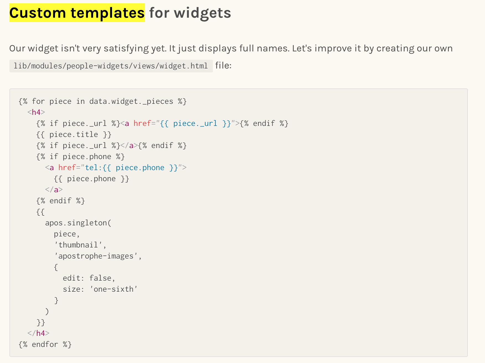

# Issues @ ApostropheCMS beginner tutorial
Developed until the end of the chapter **_Reusable content with pieces_**

## Reusable content with pieces - custom templates for widgets
After following the tutorial and adding the code for this section



it was supposed to add the full name, a thumbnail and phone number for every person added as widget. 
Instead the full name and an empty area are displayed.


## Minor improvement in - creating custom templates for individual people section
Before this section, there were no references to ***show.html*** 
It is missing Details like what it is and Where it should be added.

I managed to understand using stackoverflow.


---
---

# Apostrophe Boilerplate v2.x

Apostrophe Boilerplate is a minimal starting point for [Apostrophe 2](https://github.com/punkave/apostrophe) projects.

To get started, we recommend taking a look at [our guide to creating your first project](http://apostrophecms.org/docs/tutorials/getting-started/creating-your-first-project.html). You could also take a look at [Apostrophe's CLI](https://github.com/punkave/apostrophe) or simply fork this repository.

Once you have a local copy of this project to work from, make sure to install its dependencies with `npm install`. With Apostrophe installed, the first thing to do create an admin user account so you're able to log into the CMS. Run the following command (this will prompt you for a password).

```bash
node app.js apostrophe-users:add admin admin
```

Now you're all set! Just run `node app.js` to start up the local server and head to `localhost:3000` in your web browser.

---------------

For more documentation on Apostrophe, visit the [A2 documentation site](http://apostrophecms.com).
